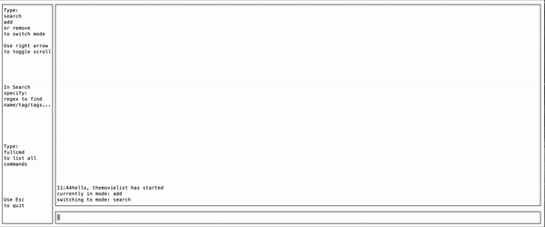

# themovielist
A command line program to make a searchable list of movies, with tags and extendable fields

I built this because sadly, I watch so many movies that it became impossible for me to keep track of 
my favorites in my head.

This is a quick and dirty movie listing utility, that makes use of tui-go for formatting the window.

The search utilizes regular expressions, which is the primary way I wanted to be able to filter and search
by multiple tags.

Future upgrades:

-Store file in compressed/binary format

-Pretty print and color output

-Minimize memory consumption when list is very large

