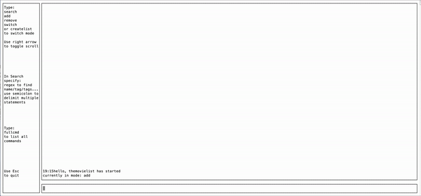

# TheList
A command line program to make a fast, searchable, in memory set of lists, with tags and extendable fields

I built this because sadly, I watch so many movies and read so many books that it became impossible for me to keep track of 
my favorites in my head.

This is a quick and dirty generic listing utility, that makes use of tui-go for coloring text and formatting the window display.

The search utilizes regular expressions, which is the primary way I wanted to be able to filter and search
by names/multiple tags.

#### Features
- Search items by regular expression
- Support for multiple lists
- Sort alphabetically
- Add/Remove list items
- Append tags to list items

#### Demo

